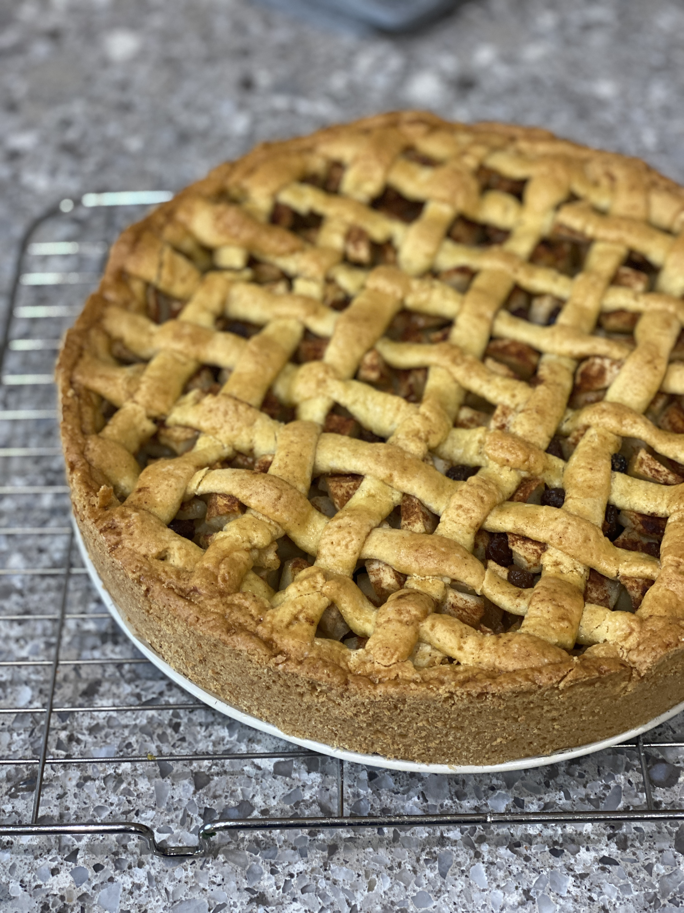

## Apple Tart

### Notes
\*If using margarine, use less than you would of butter as it's lower melting point makes the dough a little too soft at times.

\*If you take a while getting to add the filling to the tart and the apples start releasing water, drain it (and at your taste, add some more cinnamon).

### Ingredients

**Dough**

*   300g self-raising flour
*   1 free-range egg
*   175g cold butter (or 150g margarine)
*   125g caster sugar
*   a pinch of salt

**Filling**

*   1kg of hard sour apples 
*   50g sugar
*   50g currants
*   50g raisins
*   2 tsp cinnamon
*   3 tsp lemon juice

    
### Method
**Apple Mix**

1.  Soak the currants and raisins.
    
2.  Peel and chop the apples.
    
3.  When the currants and raisins are well-soaked, squeeze the water out of them.
    
4.  Mix the apples, sugar, currants, raisins, cinnamon and lemon juice.

**Tart**

5.  Preheat the oven to 175C for top-bottom heating, or 165C for fan. Prepare the rack in the lower third of the oven.
    
6.  Grease and line a springform cake pan or tart tin. I use a large springform cake pan. 
    
7.  Beat the egg with a fork.
    
8.  Cube the butter (keep it cold).
    
9.  Add the flour, sugar, butter, salt and 2/3 of the egg in a bowl. Mix.
    
10.  Knead the mix until a cohesieve dough forms. 

11.  Use 3/4 of the dough to line the tin (half on the bottom, half for the size if using a springform pan). You want raised edges at approx 3cm. 

12.  With the other 1/4 prepare making little rolls of dough that will become the criss-cross pattern. 

12.  Add the apple mixture into the cake. 

13.  Working quickly (so the apple juice doesn't start to leak into the cake before baking), flatten the rolls of dough into flat lines and lay them across the top of the cake. 

14. Brush the pattern with the rest of the egg (add a little milk to make it go further if you need).

15. Bake the pie for 1 hour and 15 minutes until done and browned. 

16. Let the apple pie cool in the pan until the crust is firm, then remove from the pan. 
