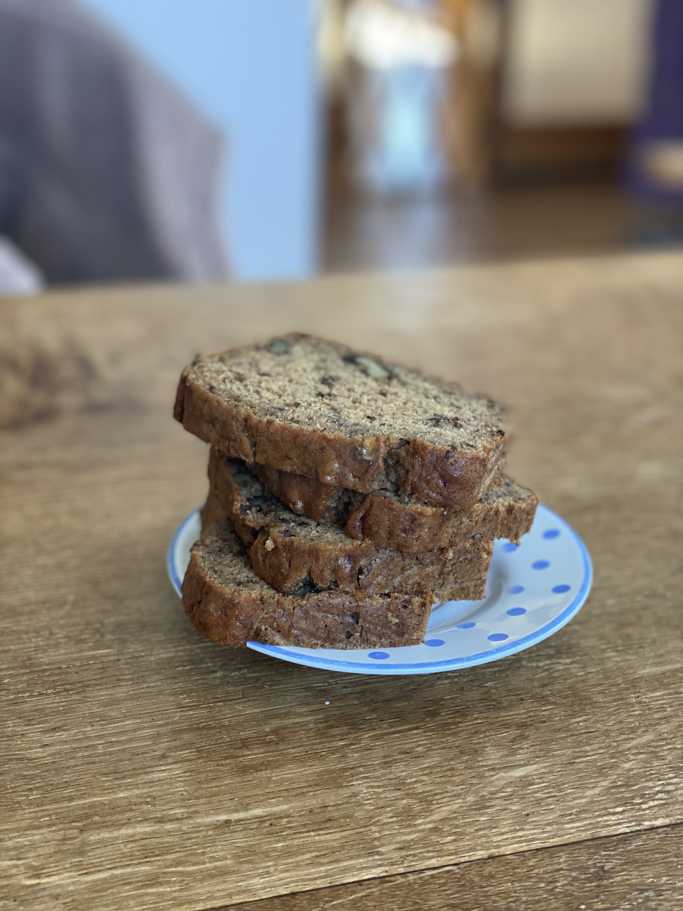

## Banana Bread

### Notes
\*The first time I made this too wet by turning the oven too low and not skewering in the center when checking it

\*Great time to mention and recommend always adding flour last, and folding it in. The longer you beat flour, the more gluten develops, making a tougher crumb (this is why you knead bread). This is also why people often use cake flour (lower gluten content). But for the most part, using normal flour and ensuring not to over-mix your batter before baking works just fine. 

\*Recipe adapated from [sallysbakingaddiction](https://sallysbakingaddiction.com/best-banana-bread-recipe/#tasty-recipes-66473), made dairy-free.

### Ingredients

*   250g plain flour
*   1 tsp bicarbonate of soda
*   $\frac{1}{4}$ tsp salt
*   $\frac{1}{2}$ tsp cinnamon
*   115g margarine / butter
*   125g dark brown sugar
*   2 large free-range eggs (room temp)
*   80g plain yogurt (vegan soy yog works fine)
*   345g mashed ripe bananas (4-5 medium, 3-4 large)
*   1 tsp vanilla
*   100g walnuts (chopped)
    
    
### Method

1.  Preheat the oven to 175C for top-bottom heating, or 165C for fan. Prepare the rack in the lower third of the oven.
    
2.  Grease and line a loaf-pan.
    
3.  Prep the dry ingredients: in a medium bowl whisk together flour, bicarb, salt and cinnamon, set the bowl aside.
    
4.  Beat together the margarine/butter and brown sugar until smooth and creamy, then add the eggs (one at a time), beating well. Beat in the yogurt, mashed bananas, and vanilla. 
    
5.  Fold in the dry ingredients. When the flour is almost mixed in, add the chopped nuts too. Do your best not to overmix the batter. 
    
6.  Pour the batter into your pan. Bake for 60-65 minutes. If the top starts getting too brown, cover it with foil. When the cake is looking ready, test it with a skewer in the middle of the loaf, it should come out clean or with crumbs. 
    
7.  Remove the bread from the oven and allow it to cool in the tin on a wire rack for around an hour before removing it from the pan and cooling directly on the rack. 
    
8.  Cover and store at room temperature for a few days, or in the fridge for up to a week. Makes around 10-12 slices. 